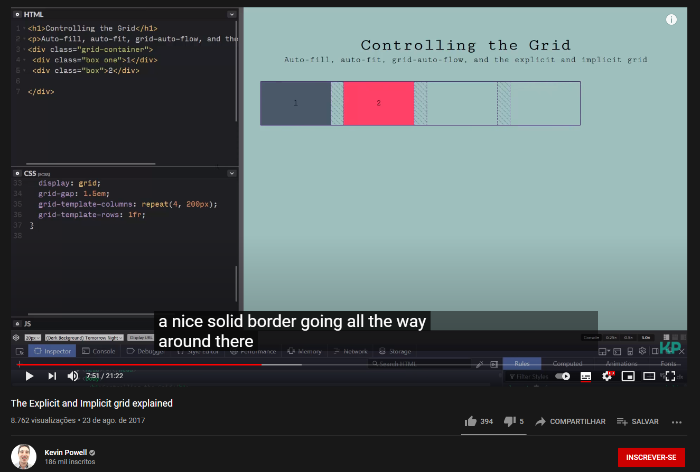
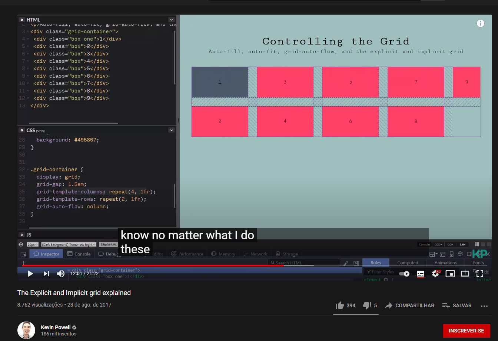
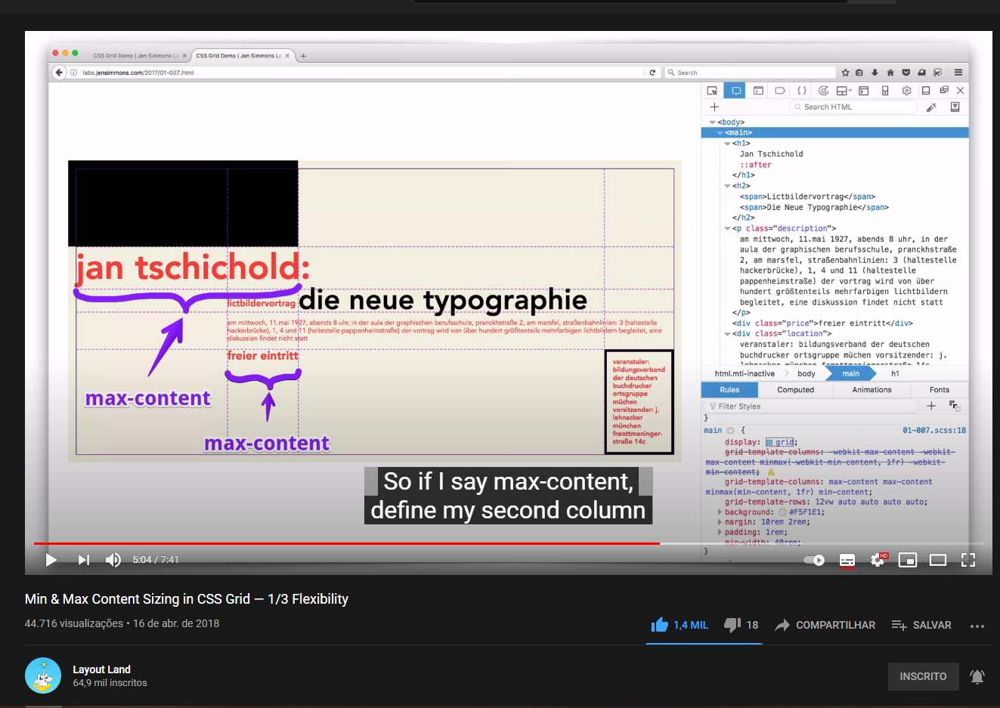

# Grid
## Implicita
- Gera linhas/colunas de forma automatica.
- Faz com que o algoritmo ajuste o número de colunas/linhas que serão geradas.
- O código abaixo fará a criação de colunas automaticamente, assim como o número de linhas e tamanho de cada uma delas.

```css
.grid-container {
  display: grid;
  grid-template-columns: repeat(auto-fit, minmax(240px, 1fr));
  grid-auto-rows: 240px;
}
```

## Explicita
- Você indica a quantidade de colunas/linhas que devem ter
```css
.grid-container {
  display: grid;
  grid-template-columns: 240px auto auto 240px;
  grid-template-rows: repeat(4, 240px);
  grid-template-areas:
    'a b c d'
    'm n n e'
    'l n n f'
    'j i h g'
  ;
}
```
- É possível observar na imagem abaixo que o navegador cria uma borda sólida na linha que foi explicitamente dito seu tamanho. Caso não seja dito o seu tamanho, essa borda será pontilhada.
- Em outras palavras, o algoritmo não decidiu o tamanho da row gerada já que foi explicitamente falado.

<p align="center">
  
</p>

- Nesse exemplo, é dito explicitamente para que as 4 colunas tenham tamanho 1fr. Porém, como o `grid-auto-flow: column` agora é column, isso fará a criação de novas colunas ao invés de rows, quando necessário, logo terá 5 colunas, mas apenas o tamanho de 4 delas foram definidos.

<p align="center">
  
</p>

```css
.grid-container {
  display: grid;
  grid-template-columns: repeat(4, 200px);
  grid-template-rows: 1fr;
}
```

**Problema da grid explicita**
- Não fará o ajuste automático de quantidade de colunas/linhas, ou seja, você deve utilizar media queries para tratar os breakpoints da página.
```css
@media screen and (max-width: 1200px) {
  .grid-container {
  display: grid;
  grid-template-columns: repeat(3, minmax(240px, 1fr));
  grid-template-rows: repeat(5, 240px);
  grid-template-areas:
    'a b c'
    'd e f'
    'g h i'
    'j l m'
    'n n n'
  ;
}
}
```

## grid-auto-flow
- Por padrão é row dense.
- Irá preencher com novas rows ao invés de preencher com novas colunas. Em outras palavras: o algoritmo da preferência para preencher rows ao invés de colunas.

## grid-column
```css
.grid {
  display: grid;
  grid-template-columns: 200px 200px;
}

.item:first-child {
  grid-column: 1 / 6; 
}
```
- Caso não exista a linha virtual 6, ela será criada.

## grid-auto-rows/columns
- Caso o navegador crie automaticamente outra linha ou coluna, posso falar explicitamente o tamanho desse nova linha ou coluna criada.

```css
.grid {
  display: grid;
  grid-template-columns: repeat(2, 200px);
  grid-auto-rows: 200px;
  grid-auto-columns: 200px;
  /*dessa forma eu consigo falar para que, caso seja criado uma nova linha ou coluna pelo navegador, que ela tenha esse tamanho*/
}

.item:first-child {
  grid-column: 1 / 4; /*não possuí 4 linhas virtuais, logo ele irá criar outra coluna automaticamente com o tamanho de colunas apenas que seja necessário para o contéudo do item*/ 
}

```

## min-content / max-content
**min-content**

- o tamanho da maior palavra de um determinado texto.

**max-content**

- o tamanho será o máximo para suportar um determinado texto.

<p align="center">
  
</p>
